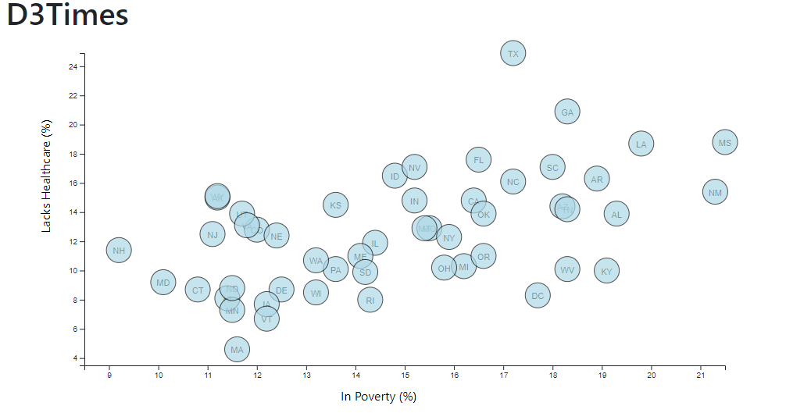
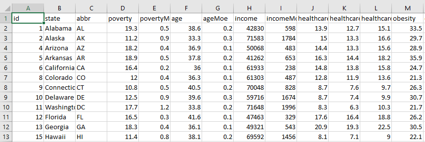

# Data Journalism and D3

## Project deployed at https://taureanh.github.io/D3_project/.

## Introduction

Welcome to the newsroom! You've just accepted a data visualization position for a major metro paper. You're tasked with analyzing the current trends shaping people's lives, as well as creating charts, graphs, and interactive elements to help readers understand your findings.

The objective of this homework is to create a scatter plot that represents each state with circle elements using D3 techniques. We'll code this graphic in the `app.js` file of our homework directory. Data will be pulled in from `data.csv` by using the `d3.csv` function.

Programs used:\
HTML\
CSS\
JavaScript.

The data set included with the assignment is based on 2014 ACS 1-year estimates: [https://factfinder.census.gov/faces/nav/jsf/pages/searchresults.xhtml](https://factfinder.census.gov/faces/nav/jsf/pages/searchresults.xhtml), but you are free to investigate a different data set. The current data set includes data on rates of income, obesity, poverty, etc. by state. MOE stands for "margin of error.

Screenshot of data

